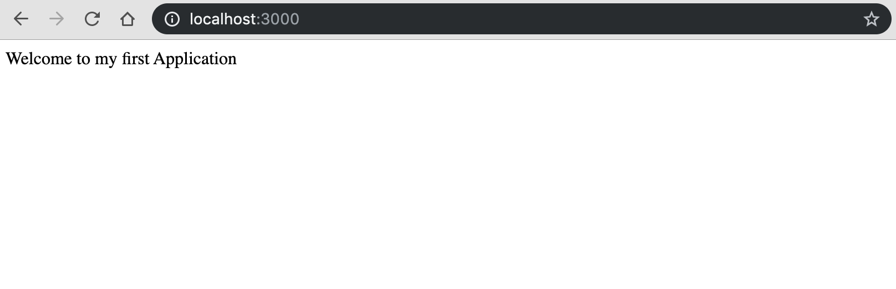

We are going to setup a minimal NodeJs application as possible. 
Before that make sure you have NodeJs installed on your computer.We will follow through few steps to accomplish the task. 


### Create a folder 

` mkdir app `

### Initialize npm 

` npm init --y` 

This will Initialize npm, I skipped the CLI entries with --y if you want you can fill in the details and skip the `--y` part


### Install dependencies 

`npm install express --save`

This command will install express on our local repo, if you skip `--save` this will install express as a global dependency which also means that you can use express without installing it on other local repos but it could be dangerous. So avoid global package installations 


### Dive into Code 


```javascript 
const express = require('express');

const app = express();

app.get('/', function( req, res ) {
  res.send("Welcome to my first application");
});

app.listen( 3000, function () {
  console.log("The application is now running on PORT 3000");
});

```

Lets go throught the code one by one. 


First we are importing a package called express, Calling the function. Whenever some hits the route `/` we greet them with 
`Welcome to my first application`. Also we are listening on port 3000. Now Head over to your browser (http://localhost:3000)to see the result.





